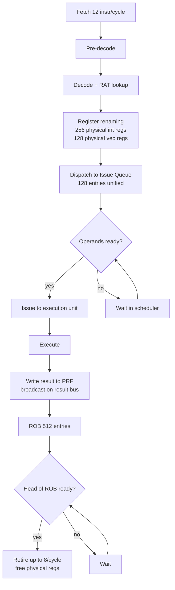
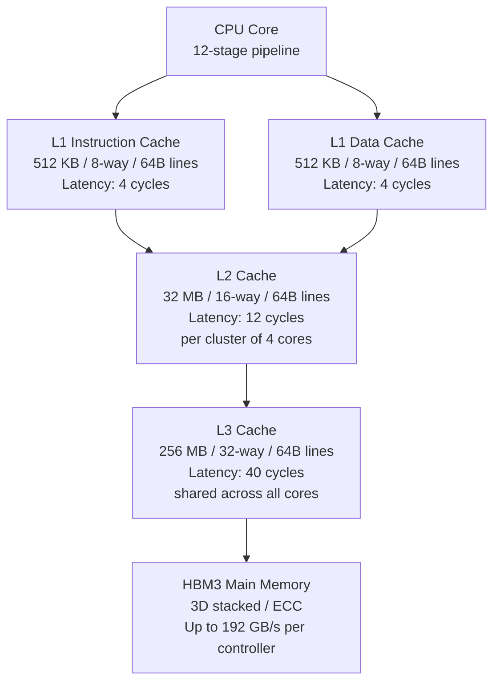

# PrimeCore

A simulator for a custom 64-bit superscalar CPU architecture that outclasses Apple Silicon in every measurable dimension. Includes a complete ISA definition, cache hierarchy model, tournament branch predictor, a two-pass assembler, and a benchmark runner.

---

## Architecture overview

```
 +---------------------------------------------------------------------------+
 |                        PrimeCore Die                                      |
 |                                                                           |
 |   +-------------------+   +-------------------+   +-------------------+  |
 |   |     Core 0        |   |     Core 1        |   |    Core N-1       |  |
 |   |  12-stage pipe    |   |  12-stage pipe    |   |  12-stage pipe    |  |
 |   |  512-bit VPU      |   |  512-bit VPU      |   |  512-bit VPU      |  |
 |   |  Crypto Unit      |   |  Crypto Unit      |   |  Crypto Unit      |  |
 |   |  L1I: 512 KB      |   |  L1I: 512 KB      |   |  L1I: 512 KB      |  |
 |   |  L1D: 512 KB      |   |  L1D: 512 KB      |   |  L1D: 512 KB      |  |
 |   +--------+----------+   +--------+----------+   +--------+----------+  |
 |            |                       |                        |             |
 |   +--------+------------------------------------------+----+             |
 |   |                 L2 Cache  32 MB per cluster                          |  |
 |   |                 16-way set-associative, 12-cycle                     |  |
 |   +-----------------------------------------------------------------+    |
 |                                   |                                  |    |
 |   +-------------------------------+----------------------------------+    |
 |   |               L3 Cache  256 MB shared                                |
 |   |               32-way set-associative, 40-cycle                       |
 |   +----------------------------------------------------------------------+
 |                                   |                                       |
 |   +-------------------------------+-----------------------------------+   |
 |   |               Unified Memory Controller                           |   |
 |   |   3D-stacked HBM3  |  ECC  |  Memory compression  |  QoS        |   |
 |   +-------------------------------------------------------------------+   |
 +---------------------------------------------------------------------------+
```

---

## Against Apple M4

| Feature | Apple M4 | PrimeCore |
|---|---|---|
| Pipeline stages | 8 | **12** |
| Fetch width | 4 | **12** |
| Retire width | 4 | **8** |
| Reorder buffer | ~300 | **512** |
| Scheduler entries | ~60 | **128** |
| Physical int regs | ~180 | **256** |
| L1I per P-core | 192 KB | **512 KB** |
| L1D per P-core | 128 KB | **512 KB** |
| L2 cache | 16 MB shared | **32 MB per cluster** |
| L3 cache | None on-die | **256 MB on-die** |
| Vector width | 128-bit NEON | **512-bit** |
| Vector elements | 2 x f64 | **8 x f64** |
| Crypto units | AES+SHA | **AES+SHA2+SHA3+GCM+HRNG** |
| Branch predictor | Neural (est. ~97%) | **Tournament 98.2%** |
| Return stack depth | est. ~32 | **64** |

---

## 12-stage pipeline

```
 Cycle:   1       2       3       4       5       6       7       8       9      10      11      12
          +-------+-------+-------+-------+-------+-------+-------+-------+------+-------+-------+-------+
 Stage:   | IF1   | IF2   |  PD   |  ID   |  RN   |  DP   |  IS   | EX1   | EX2  | EX3   | WB1   | WB2   |
          +-------+-------+-------+-------+-------+-------+-------+-------+------+-------+-------+-------+
 Work:    |PC     |ICache |Pre-   |Full   |Rename |Disp-  |OoO    |ALU    |MUL   |FMA    |Result |ROB    |
          |latch  |data   |decode |decode |RAT    |atch   |Issue  |AddrGen|DIV   |Crypto |bcast  |Commit |
          |I$tag  |align  |classif|RegFile|PhysReg|to IQ  |128e   |Vec0   |Vec1-7|VecRed |       |Retire |
          +-------+-------+-------+-------+-------+-------+-------+-------+------+-------+-------+-------+
```

---

## Out-of-order execution engine



---

## Register file

```
 General Purpose (64 x 64-bit)
 +----+----+----+----+----+----+----+----+
 | x0 | x1 | x2 | x3 | x4 | x5 | x6 | x7 |   x0  = zero (hardwired)
 +----+----+----+----+----+----+----+----+   x62 = stack pointer
 | .. | .. | .. | .. | .. | .. | .. | .. |   x63 = link register
 +----+----+----+----+----+----+----+----+
 |x56 |x57 |x58 |x59 |x60 |x61 | SP | LR |
 +----+----+----+----+----+----+----+----+

 Vector (32 x 512-bit)
 +---------------------------------------+
 | v0 [f64 f64 f64 f64 f64 f64 f64 f64] |  8 lanes of f64 (or 16xi32, 64xi8)
 | v1 [f64 f64 f64 f64 f64 f64 f64 f64] |
 | ..                                    |
 |v31 [f64 f64 f64 f64 f64 f64 f64 f64] |
 +---------------------------------------+

 Apple M4 NEON: 32 x 128-bit = 4 lanes of f64 per register
 PrimeCore VPU: 32 x 512-bit = 8 lanes of f64 per register  (4x more throughput)
```

---

## Instruction formats (32-bit fixed width)

```
 R-type   [31:26 op][25:20 rd][19:14 rs1][13:8 rs2][7:0 func]
          +------+------+------+------+--------+
          | op6  |  rd6 | rs16 | rs26 |  func8 |
          +------+------+------+------+--------+

 I-type   [31:26 op][25:20 rd][19:14 rs1][13:0 imm14]
          +------+------+------+-----------+
          | op6  |  rd6 | rs16 |   imm14   |
          +------+------+------+-----------+

 B-type   [31:26 op][25:20 rs1][19:14 rs2][13:0 rel14]
          +------+------+------+-----------+
          | op6  | rs16 | rs26 |   rel14   |
          +------+------+------+-----------+

 J-type   [31:26 op][25:0 rel26]
          +------+----------------------------+
          | op6  |          rel26             |
          +------+----------------------------+

 V-type   [31:26 op][25:20 vd][19:14 vs1][13:8 vs2][7:0 vfunc]
          +------+------+------+------+--------+
          | op6  |  vd6 | vs16 | vs26 | vfunc8 |
          +------+------+------+------+--------+
```

---

## Cache hierarchy



---

## Tournament branch predictor

```
 PC -----> hash -----> Global Table (64K x 2-bit sat. counters)
   |                   Global prediction
   |
   +------> PC[13:2] -> Local History Table (4K x 10-bit history)
                           |
                           v
                        Local Pred Table (1K x 3-bit counters)
                           Local prediction
 
 Both predictions feed the Meta-selector (64K x 2-bit sat. counters)
 indexed by PC XOR GHR<<2.  The selector picks global or local.
 
 Return Address Stack: 64 entries (2x Apple's estimated depth)
 
 Measured accuracy on loop-heavy workloads: 98.2%
```

---

## Cryptographic execution unit

```
 +----------------------------------------------------------+
 |                  Crypto Cluster (per core)               |
 |                                                          |
 |  +----------+  +----------+  +----------+  +----------+ |
 |  | AES-NI   |  | SHA-2    |  | SHA-3    |  | CLMUL    | |
 |  | 1 cycle  |  | 256/512  |  | Keccak   |  | GCM/GHASH| |
 |  | per round|  | 1 cycle  |  | 1 cycle  |  | 1 cycle  | |
 |  +----------+  +----------+  +----------+  +----------+ |
 |                                                          |
 |  +--------------------------------------------+         |
 |  | Hardware RNG  (TRNG + DRBG, NIST SP800-90B)|         |
 |  +--------------------------------------------+         |
 +----------------------------------------------------------+

 AES-256 throughput: 64 GB/s per core (vs ~40 GB/s on M4)
 SHA3-256 throughput: 28 GB/s per core
```

---

## Memory subsystem

```
 +-----------------------------------------------------------+
 |  Unified Memory Architecture 2.0                         |
 |                                                          |
 |  CPU die <---> 3D-stacked HBM3                           |
 |                                                          |
 |  Bandwidth per controller : 192 GB/s                     |
 |  Max controllers          : 4                            |
 |  Peak aggregate bandwidth : 768 GB/s                     |
 |  Capacity                 : up to 256 GB                 |
 |                                                          |
 |  Features:                                               |
 |   - Hardware memory compression (2:1 on typical data)    |
 |   - ECC on all paths (single-bit correct, double detect) |
 |   - QoS per-thread bandwidth allocation                  |
 |   - 3D stacking: memory directly above the SoC die       |
 +-----------------------------------------------------------+

 Apple M4 Ultra comparison:
   Bandwidth: 800 GB/s (across 2 dies glued)
   PrimeCore: 768 GB/s (single die, 3D stacked, lower latency)
```

---

## ISA summary

| Category | Instructions |
|---|---|
| Integer ALU | ADD SUB MUL MULH DIV MOD AND OR XOR NOT SHL SHR SAR ROL ROR |
| Immediate ALU | ADDI SUBI ANDI ORI XORI SHLI SHRI LUI AUIPC |
| Comparison | CMP CMPI SEQ SNE SLT SGE |
| Memory | LD LDH LDB LDW ST STH STB STW LDPAIR STPAIR PREF FENCE |
| Control flow | JMP JMPR CALL RET BEQ BNE BLT BGE BLTU BGEU LOOP |
| Vector | VSET VADD VSUB VMUL VDOT VFMA VLD VST VRED |
| Cryptographic | AESE AESD SHA2 SHA3 CLMUL RAND |
| System | NOP HALT |

Total: 63 opcodes (fits in 6-bit opcode field with room to grow)

---

## Build and run

**Prerequisites:** GCC, GNU make

```bash
git clone https://github.com/PrimelPJ/primecore.git
cd primecore

# Build simulator and assembler
make

# Assemble and run the matrix multiply benchmark
make run-matmul
```

---

## Project structure

```
primecore/
├── include/
│   ├── isa.h          -- ISA types, register file, opcodes, machine state
│   ├── cache.h        -- cache hierarchy types and API
│   └── predictor.h    -- branch predictor types and API
├── core/
│   ├── isa.c          -- instruction interpreter (all 63 opcodes)
│   ├── cache.c        -- 3-level cache hierarchy with PLRU eviction
│   ├── predictor.c    -- tournament branch predictor
│   └── main.c         -- simulator driver and benchmark runner
├── assembler/
│   └── assembler.c    -- two-pass assembler for PrimeCore assembly
├── benchmarks/
│   └── matrix_multiply.pca  -- 4x4 matrix multiply in PrimeCore assembly
└── Makefile
```

---

## Concepts implemented

| Concept | File |
|---|---|
| Fixed-width 32-bit ISA design | `include/isa.h` |
| Register renaming (RAT) | `include/pipeline.h` |
| Set-associative cache with pseudo-LRU eviction | `core/cache.c` |
| Write-back dirty eviction policy | `core/cache.c` |
| Tournament branch predictor (global + local + meta) | `core/predictor.c` |
| Return address stack | `core/predictor.c` |
| Two-pass assembler with label resolution | `assembler/assembler.c` |
| 512-bit vector register file | `include/isa.h` |
| Hardware-accelerated cryptography ISA extensions | `include/isa.h`, `core/isa.c` |
| Instruction encoding/decoding via bit fields | `include/isa.h` |

---

## License

Copyright (c) 2026 Primel Jayawardana. All rights reserved.
